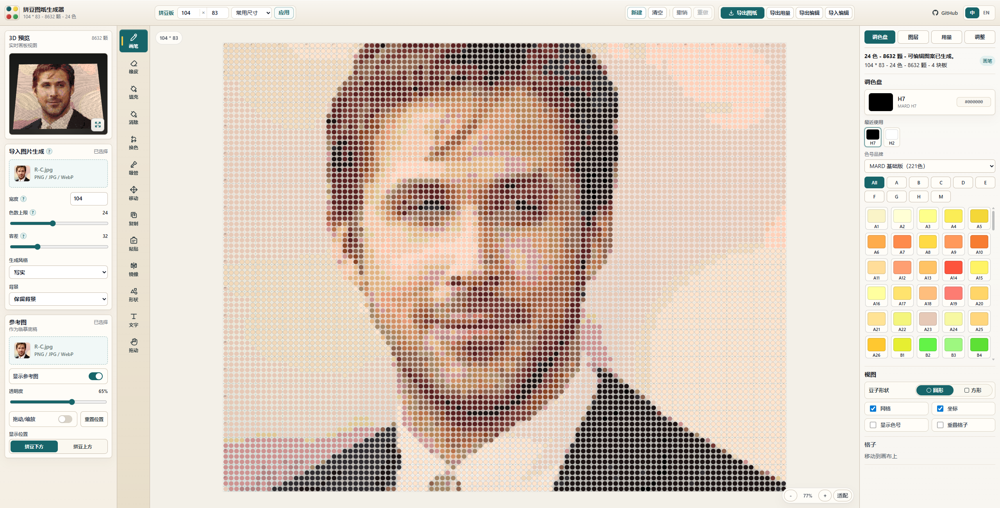
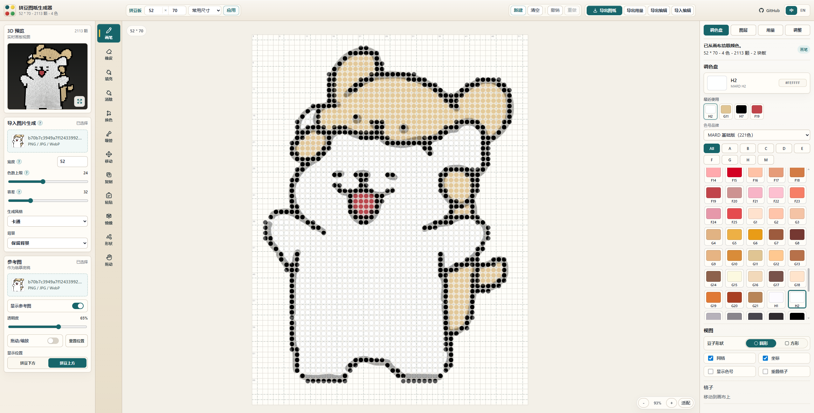
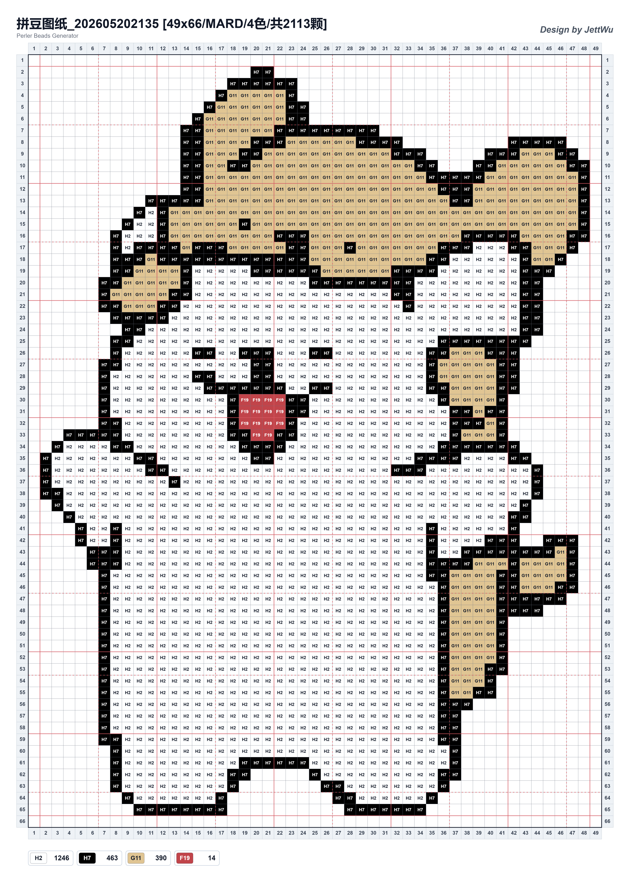
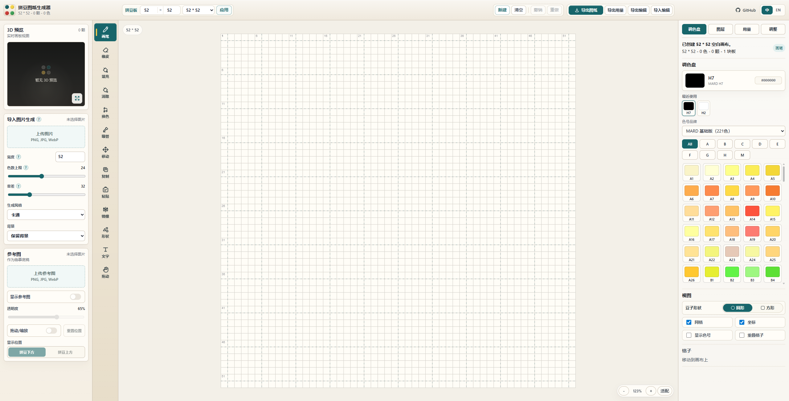

# Perler Beads Generator

Live demo: https://jett-wu.github.io/Perler_Beads_Generator/

一个强大的拼豆图纸编辑器，可以把图片转换成可打印的拼豆图纸，也可以像绘图软件一样手动编辑、分层创作、统计用量并导出高清图纸。



## 功能亮点

- **图片生成图纸**：按拼豆格区域采样图片，支持卡通 / 写实风格、色数上限、容差和背景处理。
- **MARD 色卡匹配**：内置 MARD 基础版 221 色与完整版 291 色，支持色号分组、最近使用和快速选色。
- **专业编辑工具**：画笔、橡皮、填充、消除、换色、吸管、移动、复制、粘贴、镜像、形状和文字工具。
- **文字 / 数字 / 符号插入**：支持横排、竖排、字号和间距调整，适合制作姓名、编号和装饰文字。
- **多图层工作流**：支持新建、隐藏、锁定、重命名、复制、拖拽排序、只看当前图层和按图层统计用量。
- **参考图临摹**：可上传参考图，调整透明度、位置和缩放，用于手动临摹或核对图案。
- **当前图层调整**：支持亮度、对比度、饱和度、色温、色相、反色、灰阶、黑白、颜色整理和色数上限。
- **实时 3D 预览**：模拟拼豆完成后的效果，支持放大查看，并跟随圆形 / 方形豆显示模式。
- **用量统计**：按颜色统计颗数，可设置每包数量，并估算每种颜色所需包数。
- **高清导出**：支持导出 PNG / PDF 图纸、Excel 用量清单和 JSON 编辑记录。
- **浏览器本地处理**：图片转换和编辑在浏览器中完成，不需要上传图片到服务器。

## 效果展示

### 写实风格

| 原图 | 工作台 | 导出图纸 |
| --- | --- | --- |
|  |  |  |

### 卡通风格

| 原图 | 工作台 | 导出图纸 |
| --- | --- | --- |
|  |  |  |

### 空白工作区



## 本地运行

```bash
npm install
npm run dev
```

默认预览地址：

```text
http://127.0.0.1:5174/
```

## 构建

```bash
npm run build
```

构建产物会输出到：

```text
generated/dist/
```

## GitHub Pages 部署

项目已包含 GitHub Pages 自动部署工作流：

```text
.github/workflows/deploy.yml
```

部署方式：

1. 推送代码到 `main` 分支。
2. 打开 GitHub 仓库的 `Settings -> Pages`。
3. 将 `Build and deployment` 设置为 `GitHub Actions`。
4. 之后每次推送到 `main` 都会自动构建并部署到 GitHub Pages。

## 文件结构

```text
.github/workflows/
  deploy.yml              # GitHub Pages 自动构建和部署

docs/
  realistic-workspace.png # README 首图，写实风格工作台
  realistic-pattern.png   # 写实风格导出图纸
  realistic-source.jpg    # 写实风格原图
  cartoon-workspace.png   # 卡通风格工作台
  cartoon-pattern.png     # 卡通风格导出图纸
  cartoon-source.png      # 卡通风格原图
  blank-workspace.png     # 空白工作区预览

scripts/
  clean-dist.cjs          # 清理 generated/dist
  post-build.cjs          # 拷贝样式和 vendor 文件，修正构建产物引用
  write-html.cjs          # 写入 GitHub Pages 使用的静态 HTML
  dev-server.cjs          # 本地静态预览服务

src/
  App.tsx                 # 应用状态、布局、顶部栏、左右面板和主要交互
  WorkspaceCanvas.tsx     # 2D 画布、绘制工具、参考图、复制、移动和文字逻辑
  ThreePreview.tsx        # 3D 拼豆预览
  imageToBeads.ts         # 图片转拼豆图纸算法
  palette.ts              # MARD 色卡、色号分组和颜色匹配
  project.ts              # 项目数据、图层、自动保存和兼容导入
  exporters.ts            # PNG / PDF 图纸、Excel 用量和 JSON 编辑记录导出
  usage.ts                # 用量统计和无相邻拼豆检测
  types.ts                # 共享类型定义
  styles.css              # 全局样式
  main.tsx                # React 入口

generated/
  .gitkeep                # 保留目录；构建产物和本地缓存会被忽略

index.html                # 开发入口 HTML
package.json              # 项目脚本和依赖
tsconfig.json             # TypeScript 配置
tsconfig.build.json       # 构建输出配置
```

## 技术栈

- React
- TypeScript
- Three.js
- Canvas API

## 说明

- MARD 色卡用于颜色匹配和界面显示，实际拼豆颜色可能受批次、光线和屏幕显示影响。
- 图片生成图纸时，应用会按每个拼豆格对应的原图区域采样，而不是只读取单个像素。
- JSON 编辑记录用于恢复可编辑项目，不是通用图片格式。
- 应用以桌面端使用为主，并针对不同屏幕比例、分辨率和浏览器缩放做了响应式布局处理。

---

# Perler Beads Generator

Live demo: https://jett-wu.github.io/Perler_Beads_Generator/

A powerful Perler bead pattern editor for turning images into printable bead charts, with manual editing, layers, reference tracing, usage counting, 3D preview, and high-resolution exports.


## Highlights

- **Image-to-pattern conversion** with bead-cell area sampling, cartoon / realistic styles, color limits, tolerance, and background handling.
- **MARD color matching** with built-in Basic 221-color and Complete 291-color palettes, color groups, recent colors, and fast selection.
- **Editing tools** including pencil, eraser, fill, clear, recolor, eyedropper, move, copy, paste, mirror, shapes, and text.
- **Text insertion** for letters, numbers, symbols, and Chinese characters, with horizontal / vertical layout, size, and spacing controls.
- **Layer workflow** with add, hide, lock, rename, duplicate, drag reorder, current-layer-only view, and per-layer usage counting.
- **Reference image tracing** with opacity, position, drag, and scale controls for manual tracing or visual checking.
- **Active-layer adjustments** for brightness, contrast, saturation, temperature, hue, invert, grayscale, black-white, color cleanup, and color limits.
- **Live 3D preview** with an enlarged viewer and round / square bead display modes.
- **Usage statistics** by color, custom beads-per-pack settings, and estimated packs.
- **High-resolution exports** for PNG / PDF patterns, Excel usage workbooks, and JSON edit records.
- **Local browser-side processing**. Images are processed in the browser and are not uploaded to a server.

## Gallery

### Realistic Style

| Source | Workspace | Exported Pattern |
| --- | --- | --- |
|  |  |  |

### Cartoon Style

| Source | Workspace | Exported Pattern |
| --- | --- | --- |
|  |  |  |

### Blank Workspace


## Local Development

```bash
npm install
npm run dev
```

Default preview URL:

```text
http://127.0.0.1:5174/
```

## Build

```bash
npm run build
```

Build output:

```text
generated/dist/
```

## GitHub Pages Deployment

This project includes a GitHub Pages deployment workflow:

```text
.github/workflows/deploy.yml
```

Deployment steps:

1. Push to the `main` branch.
2. Open `Settings -> Pages` in the GitHub repository.
3. Set `Build and deployment` to `GitHub Actions`.
4. Every push to `main` will build and deploy the site automatically.

## Project Structure

```text
.github/workflows/
  deploy.yml              # GitHub Pages build and deployment workflow

docs/
  realistic-workspace.png # README hero image, realistic workspace
  realistic-pattern.png   # Realistic exported pattern
  realistic-source.jpg    # Realistic source image
  cartoon-workspace.png   # Cartoon workspace
  cartoon-pattern.png     # Cartoon exported pattern
  cartoon-source.png      # Cartoon source image
  blank-workspace.png     # Blank workspace preview

scripts/
  clean-dist.cjs          # Cleans generated/dist
  post-build.cjs          # Copies styles/vendor files and fixes built imports
  write-html.cjs          # Writes the static HTML used by GitHub Pages
  dev-server.cjs          # Local static preview server

src/
  App.tsx                 # App state, layout, panels, and main interactions
  WorkspaceCanvas.tsx     # 2D editor canvas, tools, reference image, copy/move/text logic
  ThreePreview.tsx        # 3D bead preview
  imageToBeads.ts         # Image-to-bead conversion algorithm
  palette.ts              # MARD palettes, groups, and color matching
  project.ts              # Project data, layers, autosave, and import compatibility
  exporters.ts            # PNG / PDF pattern, Excel usage, and JSON export
  usage.ts                # Usage summary and isolated bead detection
  types.ts                # Shared TypeScript types
  styles.css              # Global styles
  main.tsx                # React entry

generated/
  .gitkeep                # Keeps the folder; build output and local caches are ignored

index.html                # Development HTML entry
package.json              # Scripts and dependencies
tsconfig.json             # TypeScript config
tsconfig.build.json       # Build output config
```

## Stack

- React
- TypeScript
- Three.js
- Canvas API

## Notes

- MARD palette colors are used for matching and display. Real bead colors may vary by batch, lighting, and screen calibration.
- Image conversion samples the image area covered by each bead cell instead of reading only a single pixel.
- JSON edit records are for restoring editable projects, not for general image exchange.
- The app is desktop-first and includes responsive layout handling for different screen ratios, resolutions, and browser zoom levels.
